## Projet Drupal Migration & Développement (test Fanjava)

### Prérequis

- PHP 8.1+
- Composer 2.x
- MySQL/MariaDB
- Drush 11+
- Extensions PHP : `dom`, `gd`, `mbstring`, `pdo`, `json`, `xml`
- Git
- Serveur Apache/Nginx ou DDEV/Docker pour environnement local

### Installation

Option 1 : Avec serveur Apache/Nginx 

Cloner le dépôt :

```bash
git clone https://github.com/ton-compte/drupal-migration-test.git
cd drupal-migration-test
composer install
```
Créer une base de données MySQL/MariaDB:

```bash
mysql -u root -p
CREATE DATABASE drupal9 CHARACTER SET utf8mb4 COLLATE utf8mb4_general_ci;
```
Importer la base de données:

```bash
mysql -u user -p drupal9 < bdd/install.sql
```
Créer le fichier settings.php :

```bash
cp web/sites/default/default.settings.php web/sites/default/settings.php
chmod -R 644 web/sites/default
```
Dans settings.php, localise ou ajoute les sections suivantes :
```bash
$databases['default']['default'] = [
  'database' => 'drupal9',
  'username' => 'utilisateur',
  'password' => 'mot_de_passe',
  'prefix' => '',
  'host' => '127.0.0.1',
  'port' => '3306',
  'namespace' => 'Drupal\\Core\\Database\\Driver\\mysql',
  'driver' => 'mysql',
];

$settings['hash_salt'] = 'mettez_une_chaine_aleatoire_longue_et_unique_ici';
```
Lancer avec serveur PHP :

```bash
php -S localhost:8080 -t web
```
Le site est dispo ici : http://localhost:8080/

Option 2 : Avec DDEV/Docker

```bash
ddev config --project-type=drupal9 --docroot=web --create-docroot
ddev start
ddev composer install
ddev drush sql:query --file=../bdd/install.sql
ddev drush cache:rebuild
```

Le site est dispo ici : https://drupal9-fanjava.ddev.site

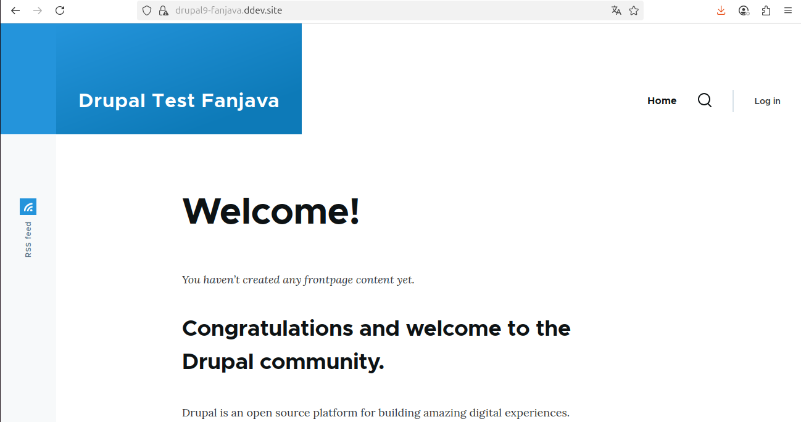

Accès Admin User name: admin  User password: fpNtjuzxWf

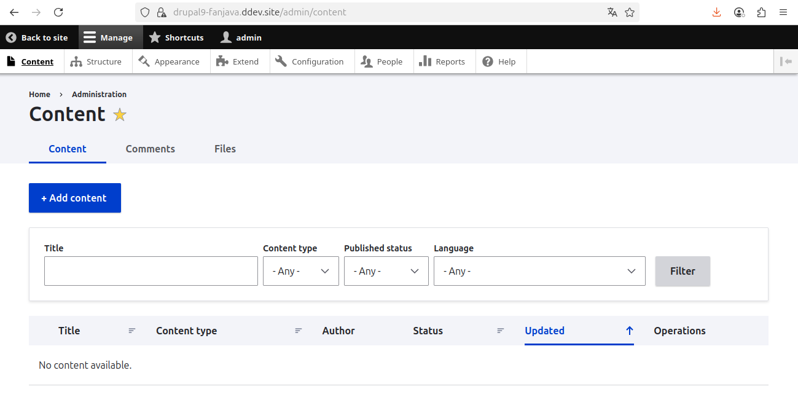

Liste de commandes utiles

```bash
    Export config : drush cex -y
    Import config : drush cim -y
    Cache clear :  drush cr
    Vider tous les caches :drush cache:rebuild
    Backup DB :  drush sql:dump --result-file=backups/db.sql
    Import DB :  drush sql:query --file=backups/db.sql
    Liste des modules : drush pm:list
    État du site : drush status
    Obtenir le lien admin : ddev drush uli
```
Sécurité

    settings.php et files/ sont exclus du Git.

    vendor/ est reconstruit via Composer.

    Les backups DB et fichiers doivent être hors du webroot.
    
### Choix techniques

- CMS : Drupal 9.x (compatible 10/11)
- Thème : Olivero
- Modules contrib :
  - Pathauto
  - Metatag
  - SEO Checklist
  - Migrate Tools
- Module custom :
  - `seo_articles_list` : bloc listant les 5 derniers articles avec champ SEO
  - `custom_dashboard` : Tableau de bord & Reporting

### Plan de migration (Checklist)

## 1. Préparation
- [x] Sauvegarde complète de la base de données et des fichiers (`core/`, `modules/`, `themes/`, `sites/default/files`).
- [x] Création d’un environnement de **staging** identique à la production pour effectuer les tests.
- [x] Vérification de la version de PHP et des extensions requises pour la nouvelle version de Drupal.

## 2. Analyse de compatibilité
- [x] Liste et vérification des **modules contrib** : mise à jour ou remplacement si non compatibles.
- [x] Analyse des **modules custom** avec **Drupal Rector** pour préparer la compatibilité.
- [x] Analyse et adaptation du **thème personnalisé** (Twig, libraries, yml…).

## 3. Migration
- [x] Mettre à jour **Composer** et ses dépendances :
- [x] Mise à jour des modules contrib et custom via Composer.
- [x] Mise à jour du core Drupal à la version cible.
- [x] Exécution des mises à jour de la base de données :
- [x] Nettoyage des caches :

## 4. Tests et validation
- [x] Vérifier le bon fonctionnement des pages et fonctionnalités clés.
- [x] Tester les formulaires, les blocs, les vues et les performances.
- [x] Analyser les logs (`admin/reports/dblog` ou `drush ws`).

## 5. Déploiement en production
- [x] Sauvegarde de production avant déploiement.
- [x] Application de la mise à jour sur le serveur live.
- [x] Test post-déploiement et surveillance.

## Partie 1 – Modélisation & Migration 

### Voici un schéma simplifié des entités (contenus, utilisateurs, modules clés). :

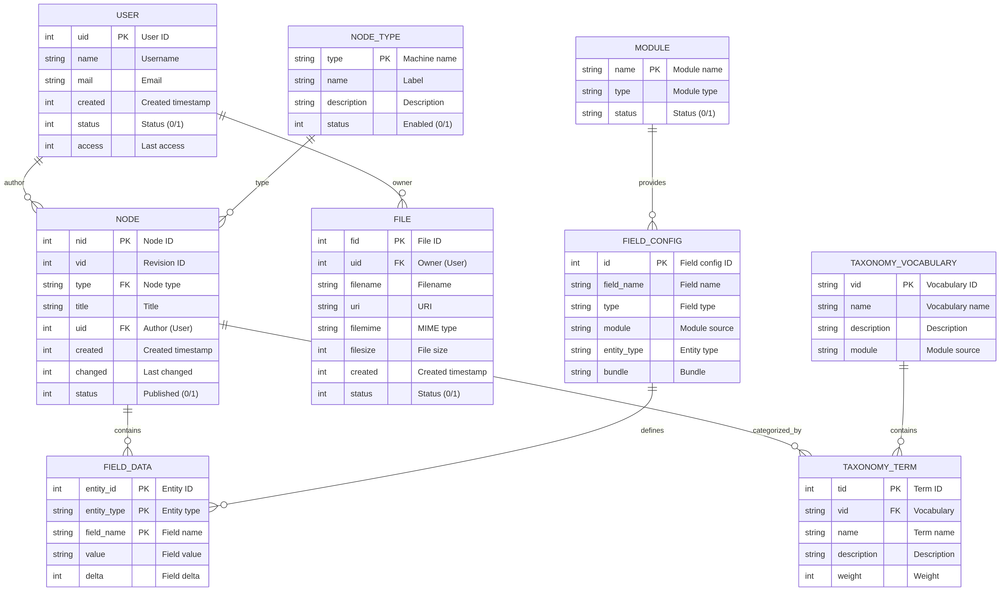

    Auteur du contenu : Relation USER.uid → NODE.uid

    Propriétaire des fichiers : Relation USER.uid → FILE.uid

    Type de contenu : Relation NODE_TYPE.type → NODE.type

    Classification : Relation TAXONOMY_TERM.tid → FIELD_DATA.value

    Champs personnalisés : Relation FIELD_CONFIG.field_name → FIELD_DATA.field_name
    
Génération jeu de données pour test : 

```bash
# Installation
ddev composer require drupal/devel
ddev drush en devel devel_generate -y

# Génération complète
ddev drush devel-generate:users 10 --kill --roles="authenticated,editor"
ddev drush devel-generate:terms tags --kill  
ddev drush devel-generate:content 100 --authors=1,2,3 --kill
```
Contenu générés dans l'admin 

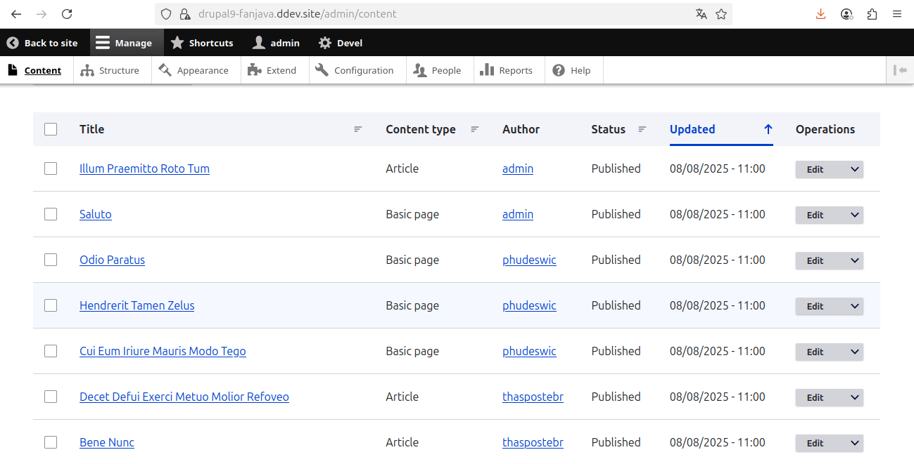
    
###  Etapes de migration de Drupal 9 à 11 (analyse modules, thèmes, compatibilité).

#### 1. Sauvegarde complète

Avant toute chose, sauvegardez :

-  Le dossier complet du projet (`code`, `sites/`, `modules/`, `themes/`, etc.)
-  La base de données MySQL/MariaDB

---

#### 2.  Audit de compatibilité

Mettre à jour au dernière version stable de Drupal 9.

Il est recommandé d'enlever Drush avant de continuer à éviter les incompatibilités courantes avec les dépendances. on revient à Drush à la fin.

```bash
$ composer remove drush/drush
```
Verifié 

##### a. Installer le module Upgrade Status

```bash
composer require drupal/upgrade_status
```
Activer le module via Admin / Extend

##### b. Analyser les modules et thèmes

- Lancez l’analyse via l’interface admin (`/admin/reports/upgrade-status`)

- Analyser le code avec drupal rector 

      Appliquer les corrections rector
      Corriger manuellement les cas complexes

#### 3.  Mise à jour vers Drupal 10

##### a. Mettre à jour les dépendances dans Composer

```bash
composer require 'drupal/core-recommended:^10' \
                 'drupal/core-composer-scaffold:^10' \
                 'drupal/core-project-message:^10' \
                 --update-with-dependencies
```

##### b. Mettre à jour les modules contribs 

```bash
composer outdated "drupal/*"
composer update drupal/[nom_du_module]
```

##### c. Mettre à jour la base de données

```bash
drush updb
drush cr
```

**Vérifiez que tout fonctionne en Drupal 10 sinon corriger avant de continuer.

---

#### 4. Mise à jour vers Drupal 11

##### a. Mettre à jour les dépendances Composer

```bash
composer require 'drupal/core-recommended:^11' \
                 'drupal/core-composer-scaffold:^11' \
                 'drupal/core-project-message:^11' \
                 --update-with-dependencies
```

##### b. Mise à jour de la base de données

```bash
drush updb
drush cr
```
---

#### 5.  Tests post-migration

##### À vérifier et corriger si erreur:

- Pages front-end (menus, vues, blocs, médias…)
- Back-office (formulaires, config, permissions…)
- Modules contribs : activés ? fonctionnels ?
- Thèmes (custom ou contrib) : rendu correct ?
- Logs (`admin/reports/dblog`) : erreurs ? warnings ?
- SEO : URLs, balises meta, sitemap...

---

#### 6.  Nettoyage

- Supprimer les modules obsolètes ou dépréciés
- Mettre à jour le fichier `composer.lock` dans Git
---
La migration **ne peut pas se faire directement** de Drupal 9 vers 11 : Drupal 10 est une étape obligatoire.

### Plan de Rollback en cas d’échec

> En cas de problème lors d'une mise à jour, suivez ce plan de rollback :

1. **Sauvegarde avant migration** :
   - Base de données : `drush sql-dump > backup.sql`
   - Fichiers : `tar -czf site-backup.tar.gz web/`

2. **Restaurer les fichiers** :
   ```bash
   tar -xzf site-backup.tar.gz
   ```

3. **Restaurer la base de données** :
   ```bash
   drush sqlc < backup.sql
   ```

4. **Réinstaller les dépendances précédentes si besoin** :
   ```bash
   composer install
   ```

5. **Vérifier** :
   - Pages critiques accessibles
   - Modules activés
   - Cache vidé

**Ceci est important**

Tout au long du développement et de la migration du projet, il est essentiel de mettre en place une intégration et un déploiement continus (CI/CD) via GitHub Actions. À chaque push sur la branche main, le déploiement doit s’exécuter automatiquement. En cas d’échec, un rollback automatique vers la dernière version stable doit être déclenché.

Il est également recommandé de mettre en place un environnement de staging identique à la production, afin de valider les changements avant leur déploiement final.

Voici un exemple simple de pipeline GitHub Actions pour un projet Drupal, incluant :

    Installation & tests
    Déploiement automatique si tout passe
    Rollback automatique en cas d’échec 

Structure du dépôt 


├── .github/

│   └── workflows/

│       └── deploy.yml

├── public_html/ (ou web/)

├── composer.json

├── ...

Contenu du fichier : .github/workflows/deploy.yml

```bash
name: Drupal CI/CD with DB Backup & Rollback

on:
  push:
    branches: [main]

env:
  DEPLOY_PATH: /var/www/drupal
  RELEASES_PATH: ${{ env.DEPLOY_PATH }}/releases
  SHARED_PATH: ${{ env.DEPLOY_PATH }}/shared
  BACKUP_PATH: ${{ env.SHARED_PATH }}/backups
  CURRENT_PATH: ${{ env.DEPLOY_PATH }}/current
  TIMESTAMP: $(date +%Y%m%d%H%M%S)
  DB_BACKUP_FILE: pre-deploy-${{ env.TIMESTAMP }}.sql.gz

jobs:
  build-test-deploy:
    runs-on: ubuntu-latest
    steps:
    # --- ÉTAPE 1: PRÉPARATION ---
    - name: Checkout code
      uses: actions/checkout@v4

    - name: Setup PHP
      uses: shivammathur/setup-php@v2
      with:
        php-version: '8.1'
        extensions: mbstring, xml, curl, gd, intl, pdo_mysql, bcmath

    # --- ÉTAPE 2: BACKUP BDD PRÉ-DÉPLOIEMENT ---
    - name: Database Backup (Pre-Deploy)
      uses: appleboy/ssh-action@v1
      env:
        DEPLOY_KEY: ${{ secrets.SSH_PRIVATE_KEY }}
      with:
        host: ${{ secrets.SERVER_IP }}
        username: ${{ secrets.SSH_USER }}
        key: ${{ secrets.SSH_PRIVATE_KEY }}
        script: |
          mkdir -p ${{ env.BACKUP_PATH }}
          cd ${{ env.CURRENT_PATH }}
          drush sql:dump --gzip --result-file=${{ env.BACKUP_PATH }}/${{ env.DB_BACKUP_FILE }}
          echo "Backup BDD créé : ${{ env.BACKUP_PATH }}/${{ env.DB_BACKUP_FILE }}"

    # --- ÉTAPE 3: TESTS ---
    - name: Install dependencies
      run: |
        composer install --no-dev --no-interaction --optimize-autoloader
        npm ci --prefix theme/custom/your_theme

    - name: Run tests
      run: |
        ./vendor/bin/phpunit --configuration=web/core web/modules/custom
        npm run test --prefix theme/custom/your_theme

    # --- ÉTAPE 4: DÉPLOIEMENT ---
    - name: Prepare deployment
      id: prepare
      run: |
        RELEASE_DIR="release-${{ env.TIMESTAMP }}"
        echo "RELEASE_NAME=$RELEASE_DIR" >> $GITHUB_ENV

    - name: Deploy to production
      uses: appleboy/ssh-action@v1
      env:
        DEPLOY_KEY: ${{ secrets.SSH_PRIVATE_KEY }}
      with:
        host: ${{ secrets.SERVER_IP }}
        username: ${{ secrets.SSH_USER }}
        key: ${{ secrets.SSH_PRIVATE_KEY }}
        script: |
          # 1. Créer nouvelle release
          RELEASE_DIR="${{ env.RELEASES_PATH }}/${{ env.RELEASE_NAME }}"
          mkdir -p $RELEASE_DIR
          
          # 2. Lier les ressources partagées
          ln -s ${{ env.SHARED_PATH }}/files $RELEASE_DIR/web/sites/default/files
          ln -s ${{ env.SHARED_PATH }}/settings.local.php $RELEASE_DIR/web/sites/default/settings.local.php
          
          # 3. Copier le code
          rsync -az --delete --exclude='.git' --exclude='node_modules' $GITHUB_WORKSPACE/ $RELEASE_DIR/
          
          # 4. Activer la release
          ln -nfs $RELEASE_DIR ${{ env.CURRENT_PATH }}
          
          # 5. Opérations post-déploiement
          cd ${{ env.CURRENT_PATH }}
          drush updatedb -y
          drush cache:rebuild
          drush config:import -y
          
          # 6. Vérification finale
          if ! drush status --fields=bootstrap | grep -q 'Successful'; then
            echo "Échec vérification Drush!"
            exit 1
          fi

    # --- ÉTAPE 5: NETTOYAGE SUCCÈS ---
    - name: Cleanup on success
      if: ${{ success() }}
      uses: appleboy/ssh-action@v1
      with:
        host: ${{ secrets.SERVER_IP }}
        username: ${{ secrets.SSH_USER }}
        key: ${{ secrets.SSH_PRIVATE_KEY }}
        script: |
          # Supprimer les backups anciens (> 7 jours)
          find ${{ env.BACKUP_PATH }} -name "*.sql.gz" -mtime +7 -delete
          echo "Déploiement réussi !"

    # --- ÉTAPE 6: ROLLBACK AUTOMATIQUE (CODE + BDD) ---
    - name: Rollback on failure
      if: ${{ failure() }}
      uses: appleboy/ssh-action@v1
      with:
        host: ${{ secrets.SERVER_IP }}
        username: ${{ secrets.SSH_USER }}
        key: ${{ secrets.SSH_PRIVATE_KEY }}
        script: |
          # A. Rollback du code
          PREV_RELEASE=$(ls -t ${{ env.RELEASES_PATH }} | grep release- | head -2 | tail -1)
          
          if [ -n "$PREV_RELEASE" ]; then
            echo "Rollback code vers: $PREV_RELEASE"
            ln -nfs ${{ env.RELEASES_PATH }}/$PREV_RELEASE ${{ env.CURRENT_PATH }}
          fi
          
          # B. Rollback de la base de données
          if [ -f "${{ env.BACKUP_PATH }}/${{ env.DB_BACKUP_FILE }}" ]; then
            echo "Restauration BDD: ${{ env.DB_BACKUP_FILE }}"
            cd ${{ env.CURRENT_PATH }}
            drush sql:drop -y
            gunzip -c ${{ env.BACKUP_PATH }}/${{ env.DB_BACKUP_FILE }} | drush sql:cli
            drush cache:rebuild
            echo "Restauration BDD terminée!"
          else
            echo "Aucun backup BDD trouvé !"
          fi
          
          # C. Supprimer la release défectueuse
          rm -rf ${{ env.RELEASES_PATH }}/${{ env.RELEASE_NAME }}
          
          # D. Supprimer le backup temporaire
          rm -f ${{ env.BACKUP_PATH }}/${{ env.DB_BACKUP_FILE }}
```

## Partie 2 – Développement d’un module custom

Dans Structure > Types de contenu > Article > Gérer les champs.
Ajouter un champ "Score SEO" / field_score_seo (type Nombre entier).

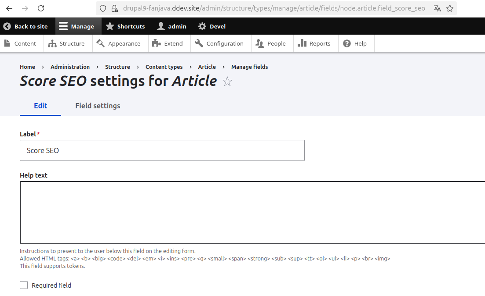 

Activer le module custom "SEO Articles list" dans l'admin

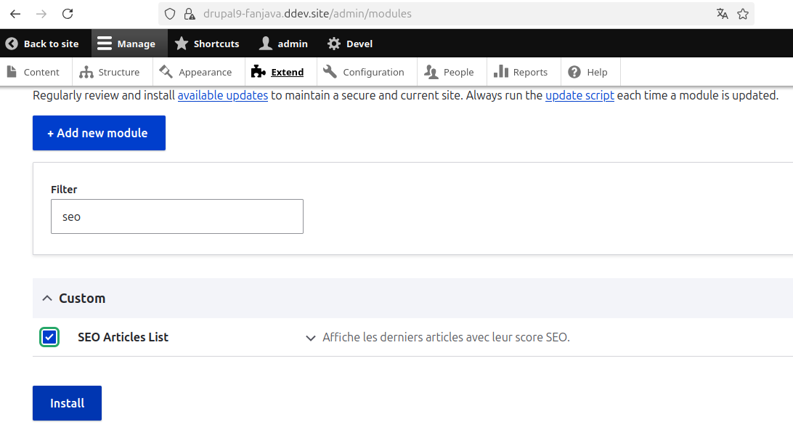

Editer les articles pour mettre à jour le score seo

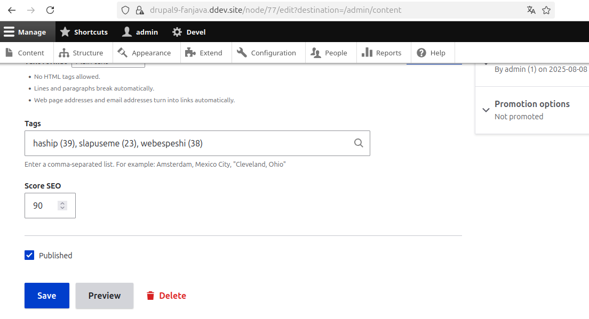

Ajouter le block dans Admin > Structure > Block Layout

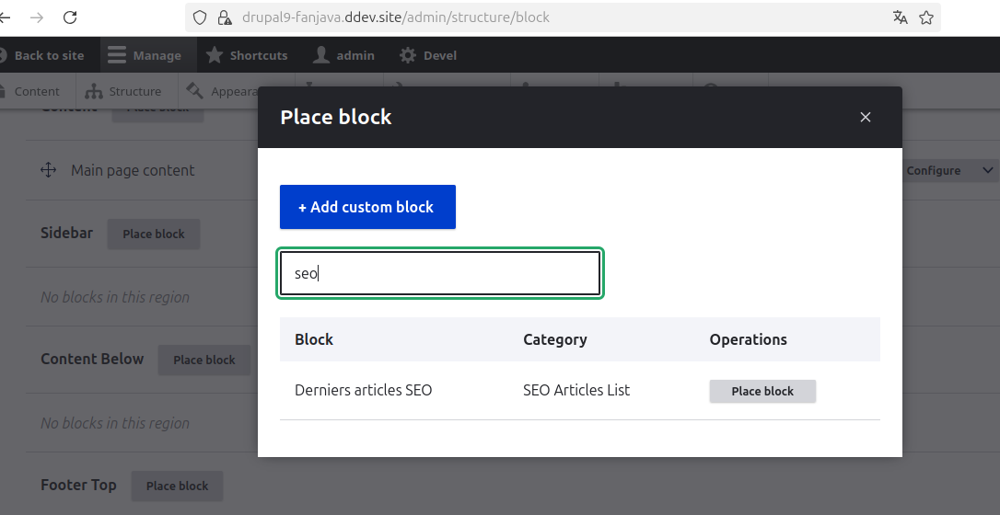

Configurer le block

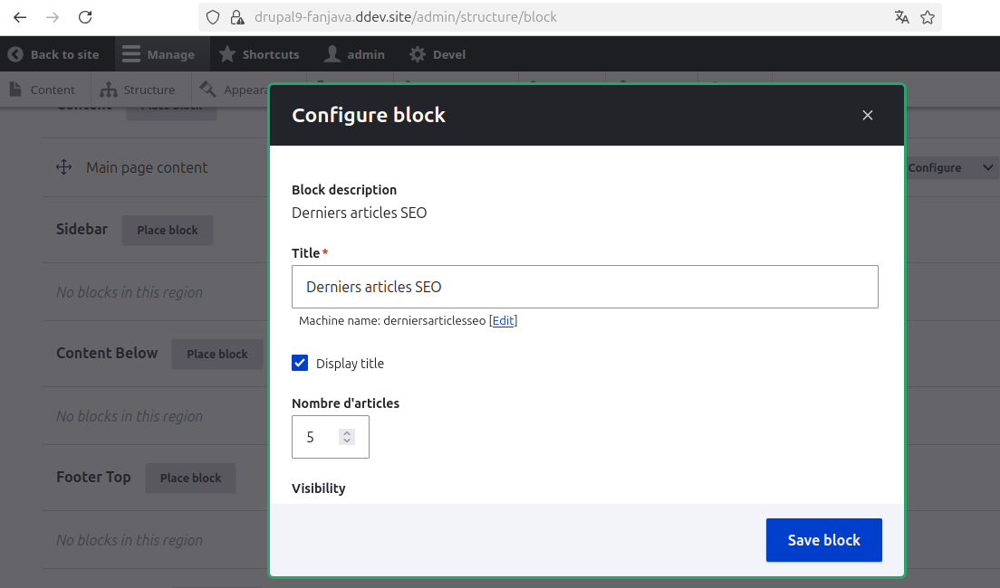

Vérifier en Front 

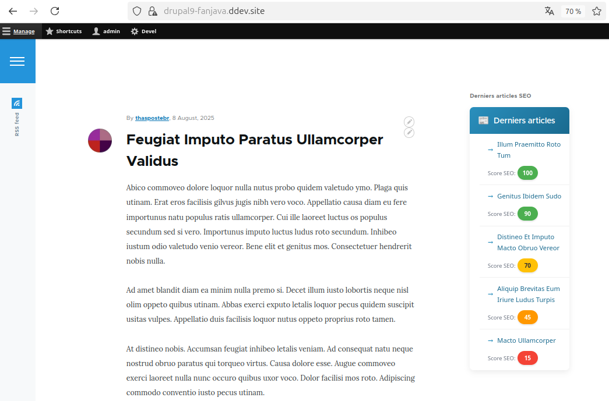

## Partie 3 – Automatisation & Sécurité

Voici un exemple de script Drush utilisable en ligne de commande ou via un cron pour
sauvegarder la base de données avec Drush et vider les caches Drupal

Créer un fichier /chemin/vers/drupal-backup-cron.sh et ajouter
```bash
  # Répertoire de sauvegarde
  BACKUP_DIR="/var/backups/drupal"
  DATE=$(date +'%Y-%m-%d_%H-%M-%S')
  BACKUP_FILE="$BACKUP_DIR/db_backup_$DATE.sql.gz"

  # Créer le répertoire de backup s'il n'existe pas
  mkdir -p "$BACKUP_DIR"

  # Aller dans le projet Drupal 
  cd /chemin/vers/le/projet

  # Sauvegarde de la base de données
  drush sql:dump --gzip --result-file="$BACKUP_FILE"

  # Purge du cache
  drush cr

  # Log
  echo "Backup effectué : $BACKUP_FILE"
```

Pour exécuter ce script tous les jours à 2h du matin :

```bash
  crontab -e
```
Ajoute la ligne suivante :

```bash
0 2 * * * /chemin/vers/drupal-backup-cron.sh >> /var/log/drupal-backup.log 2>&1
```

#### ✅ Checklist de sécurité Drupal

- [x] **Headers HTTP de sécurité** configurés (CSP, HSTS, X-Frame-Options, X-Content-Type-Options, Referrer-Policy, etc.)
- [x] **HTTPS** activé avec certificat SSL/TLS valide (Let’s Encrypt ou autre) et configuration TLS forte
- [x] **Configuration PHP durcie** : fonctions dangereuses désactivées (`exec`, `shell_exec`, etc.), `display_errors` désactivé en production
- [x] **Permissions fichiers** sécurisées (`644` pour les fichiers, `755` pour les dossiers) et interdiction d’écriture sur le core
- [x] **Base de données sécurisée** : utilisateur dédié avec droits limités, mot de passe fort et accès restreint
- [x] **Modules de sécurité** (ex. : [Security Kit](https://www.drupal.org/project/seckit), [Captcha](https://www.drupal.org/project/captcha)) installés et configurés
- [x] **Journalisation et monitoring** activés (logs Drupal, syslog, SIEM si possible)
- [x] **Fail2Ban** ou équivalent configuré pour bloquer les IP après tentatives répétées d’accès non autorisé
- [x] **Sauvegardes automatisées** de la base et des fichiers, régulièrement testées pour restauration
- [x] **Mises à jour de sécurité** appliquées rapidement (core, modules, thèmes)

 
#### Résumé des éléments critiques
Headers de sécurité essentiels

  Content-Security-Policy - Prévient XSS
  
  Strict-Transport-Security - Force HTTPS
  
  X-Frame-Options - Anti-clickjacking
  
  X-Content-Type-Options - Anti-MIME sniffing
  
  Referrer-Policy: strict-origin-when-cross-origin

#### Configuration serveur prioritaire

  HTTPS obligatoire avec TLS 1.2+
  
  Masquage des headers révélateurs (Server, X-Powered-By)
  
  Limitation de taux pour éviter le spam/DDoS
  
  Blocage des fichiers sensibles (.htaccess, settings.php)

## Partie 4 – Tableau de bord & Reporting 

Activer le module "Custom Dashboard" dans l'admin

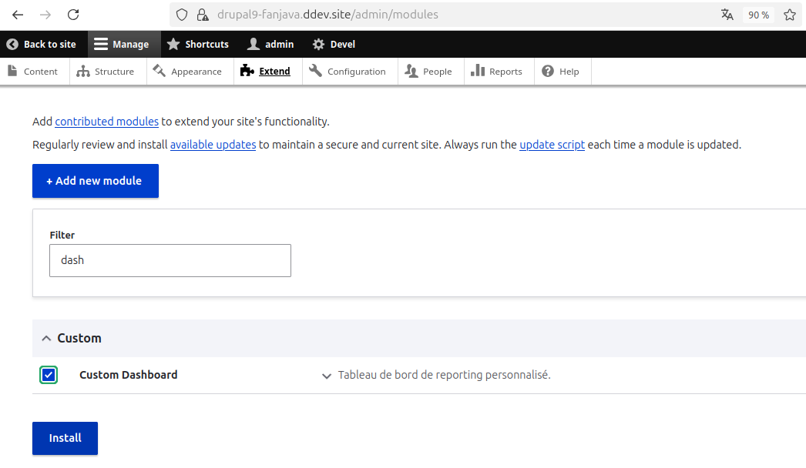

Vérifier en Front https://drupal9-fanjava.ddev.site/admin/dashboard

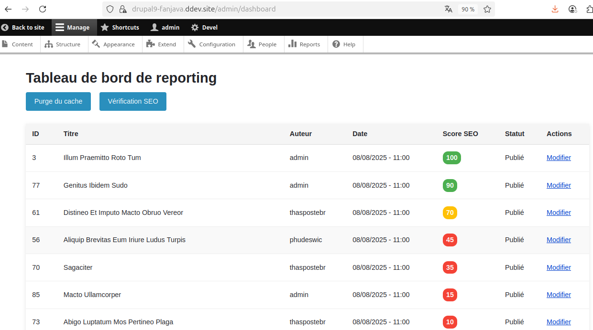

